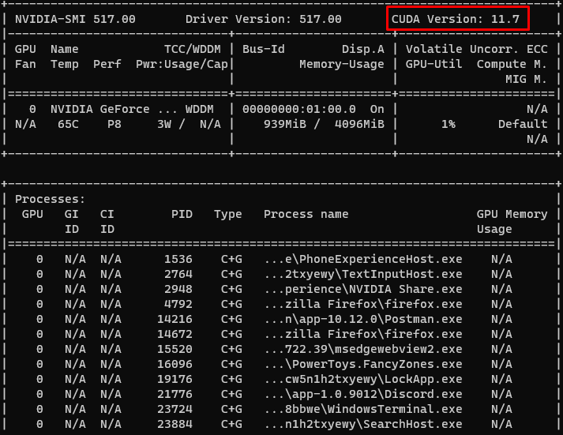

# Configuration file reference

This is what a configuration file looks like:

```ini
[DATABASE]
HOST=localhost
PORT=5432
USER=postgres
PASSWORD=postgres

[RABBITMQ]
HOST=localhost
PORT=5672
USER=guest
PASSWORD=guest
INSTANCE_CONTROLLER_QUEUE=instance_ctl
ACK_DEVICE_STATUS_QUEUE=instance_ack_device_state
ACK_DEVICE_DELETE_QUEUE=instance_ack_device_delete

[HARDWARE_ACCELERATION]
PROCESSING_MODE=GPU
CUDA_VERSION=11.7
```

The following table lists the configuration parameters that can be set in the configuration file for the image processor module.

### Sections

#### DATABASE

The `DATABASE` section contains the configuration parameters for the database connection.

| Parameter  | Description            | Example     |
| ---------- | ---------------------- | ----------- |
| `HOST`     | The database host.     | `localhost` |
| `PORT`     | The database port.     | `5432`      |
| `USER`     | The database user.     | `postgres`  |
| `PASSWORD` | The database password. | `postgres`  |

#### RABBITMQ

The `RABBITMQ` section contains the configuration parameters for the RabbitMQ connection.

| Parameter                   | Description                                                       | Example                      |
| --------------------------- | ----------------------------------------------------------------- | ---------------------------- |
| `HOST`                      | The RabbitMQ host.                                                | `localhost`                  |
| `PORT`                      | The RabbitMQ port.                                                | `5672`                       |
| `USER`                      | The RabbitMQ user.                                                | `guest`                      |
| `PASSWORD`                  | The RabbitMQ password.                                            | `guest`                      |
| `INSTANCE_CONTROLLER_QUEUE` | The RabbitMQ queue for control messages for the instance manager. | `instance_ctl`               |
| `ACK_DEVICE_STATUS_QUEUE`   | The RabbitMQ queue to acknowledge device status messages.         | `instance_ack_device_state`  |
| `ACK_DEVICE_DELETE_QUEUE`   | The RabbitMQ queue to acknowledge device remove messages.         | `instance_ack_device_delete` |

#### RTSP Server

The `RTSP_SERVER` section contains the configuration parameters for the RTSP server.

| Parameter | Description                                                                  | Example     |
| --------- | ---------------------------------------------------------------------------- | ----------- |
| `PORT`    | The port where the RTSP server will be listening for incoming RTSP requests. | `8554`      |
| `HOST`    | The host where the RTSP server will be listening for incoming RTSP requests. | `localhost` |

#### Hardware Acceleration

Each docker instance of the image processor module can be configured to use either the CPU or the GPU for the image processing and recognition.

The `Hardware Acceleration` section contains the configuration parameters for the hardware acceleration of the image processing and recognition of the docker instances.

| Parameter       | Description                                                                              | Example        |
| --------------- | ---------------------------------------------------------------------------------------- | -------------- |
| PROCESSING_MODE | The hardware acceleration mode for the image processing of the image processor instances | `GPU` or `CPU` |
| CUDA_VERSION    | The CUDA version to use for the image processing of the image processor instances.       | `11.7`         |

!!! note "Cuda with GPU"

    `CUDA_VERSION` is only used when `PROCESSING_MODE` is set to `GPU`.

##### Docker with GPU OS support

To run a docker container with GPU support, the host machine needs to have the [Nvidia Container Toolkit](https://docs.nvidia.com/datacenter/cloud-native/container-toolkit/install-guide.html#docker) installed.

The Nvidia Container Toolkit has only support for the `Linux` operating system. You can find more information about the supported linux distributions [here](https://docs.nvidia.com/datacenter/cloud-native/container-toolkit/install-guide.html#supported-os).

!!! info "WSL 2"

    If you are using *WSL 2* with one of the distributions supported, you can use the following guide to install [CUDA on WSL2](https://docs.nvidia.com/cuda/wsl-user-guide/index.html).

!!! info "Running with CPU"

    If you don't have a GPU or for some reason you can't run the docker container with GPU support, you can run the manager to use docker containers that run image processing and recognition on the CPU. In this case you can set `PROCESSING_MODE` to `CPU`. Keep in mind that this will result in a huge performance loss in the image detection and stream processing.

##### Find the CUDA version of your GPU

First of all you need to have a nvidia GPU that supports CUDA. You can find a list of supported GPUs [here](https://developer.nvidia.com/cuda-gpus).

If you have a supported GPU, you can find the CUDA version of your GPU by running the following command:

```bash
nvidia-smi
```

You should get an output similar to this one:

[](../assets/img/nvidia_smi_output.png)

Now you can set the `CUDA_VERSION` to the version of your GPU.

#### Logging

The `Logging` section contains the configuration parameters for the logging.

TODO: Add logging configuration parameters.
